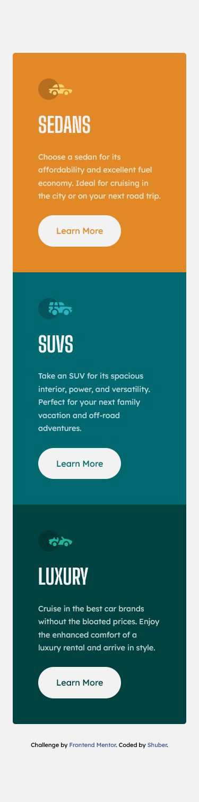

# Frontend Mentor - QR code component solution

This is a solution to the [3-Column Preview Card component challenge on Frontend Mentor](https://www.frontendmentor.io/challenges/3column-preview-card-component-pH92eAR2-). Frontend Mentor challenges help you improve your coding skills by building realistic projects.

## Table of contents

- [Overview](#overview)
  - [Screenshot](#screenshot)
  - [Links](#links)
- [My process](#my-process)
  - [Built with](#built-with)
  - [What I learned](#what-i-learned)
- [Author](#author)

## Overview

Hi! This is my attempt at the 3-Column preview card component challenge.

I decided to make some major changes to my approach compared to previous challenges, and I went for a mobile-first approach overall.

I initially considered setting the breakpoint for the grid at 768px, but I found each card still a little too narrow for my liking, and found it looking better at 1024px and above.

### Screenshot

Desktop

Mobile

### Links

- Solution URL: [Here!](https://github.com/sheronimo/frontendmentor-3colcard)
- Live Site URL: [Here!](https://sheronimo.github.io/frontendmentor-3colcard/)

## My process

1. I went for a mobile-first approach, styling the columns as they appeared vertically first.
2. Only after fine-tuning the spacing and layout of the components to match the design images as much as possible did I then work on media queries for larger screens.
3. For the styling, I used SASS and attempted to modularise my structure into a main file and partials for: variables and media queries.

### Built with

- Semantic HTML5 markup
- SASS
- Flexbox
- Grid

### What I learned

I learned how to tackle a mobile-first approach to styling and positioning components; typically I've always worked on large screens first and then worked my way down from there.

## Author

- Github - [sheronimo](https://github.com/sheronimo)
- Frontend Mentor - [@sheronimo](https://www.frontendmentor.io/profile/sheronimo)
